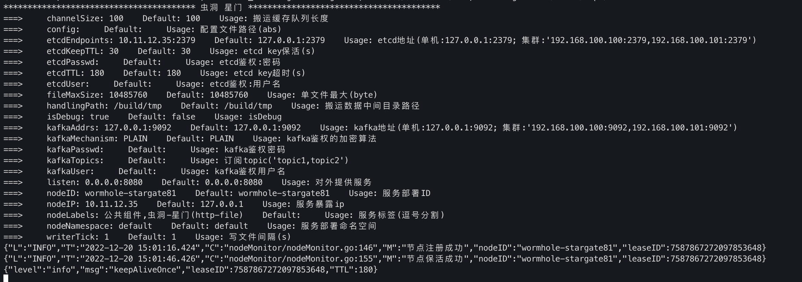

# 虫洞（Wormhole）项目

## 一、项目简介
“虫洞”是一个基于Golang开发的单向网闸数据传输系统，旨在实现不同网络之间安全、可靠的单向数据传输。系统支持HTTP转发、Kafka消息摆渡等跨网功能，为用户提供灵活、高效的网络隔离和数据交换解决方案。

## 二、功能特性
HTTP转发：支持将内网HTTP请求通过安全通道转发至外网，保障内网数据单向流出，防止外网数据流入。
Kafka消息摆渡：实现Kafka消息的单向摆渡，确保消息从内网安全地传输至外网Kafka集群，保障数据安全与隔离。
高性能：基于Golang的并发模型设计，支持高并发、低延迟的数据传输。
可扩展性：系统架构清晰，模块间解耦，便于后续功能扩展和定制开发。
安全性：严格遵循单向传输原则，确保数据只出不进，防止网络攻击和数据泄露。

## 三、支持的场景

- [x] http请求 ==> FTP ==> http请求
- [ ]  ~~http请求 ==> FTP ==> kafka~~
- [ ]  ~~http请求 ==> FTP ==> ES~~
- [ ] http请求 ==> kafka ==> http请求
- [ ]  ~~http请求 ==> kafka ==> ES~~
- [x] kafka ==> FTP ==> kafka
- [ ] kafka ==> kafka ==> kafka
- [ ] ~~kafka ==> FTP ==> ES~~
- [ ] .etc


## 四、部署方案


## 五、实现方案:


### 1.部署参数

#### 1.1 docker-compose

提供 `docker-compose.yml`, 在实际部署时, 注意区分

##### 1.1.1 配置 http -> file -> http

###### wormhole-stargate

```yaml
version: '3.8'
services:
  wormhole-stargate:
    image: wormhole-stargate:main-a5518602-build40831-1.0-alph
    privileged: true
    restart: always
    ports:
      - 8080:8080 # MARK: 暴露8080端口用于请求
    environment:
      WORMHOLE_CHANNELSIZE: "100" # MARK: 数据搬运队列, HTTP请求时, 支持同时处理的请求并发数
      WORMHOLE_LISTEN: "0.0.0.0:8080" # MARK: HTTP server 监听的地址
      WORMHOLE_HANDLINGPATH: "/build/tmp" # MARK: 缓存目录  网闸(单导)的目录地址
    command:
      - /app/stargate
      - http
      - file
    volumes:
      - /root/wormhole/handlingPath/http:/build/tmp
```

###### wormhole-dimension

```yaml
version: '3.8'
services:
  wormhole-dimension:
    image: wormhole-dimension:main-a5518602-build40831-1.0-alph
    privileged: true
    restart: always
    environment:
      WORMHOLE_CHANNELSIZE: "100" # MARK: 数据搬运队列
      WORMHOLE_BIND: "10.10.11.218:32000" # MARK: HTTP 模式下, 目标请求地址
      WORMHOLE_SCANINTERVAL: "5" # MARK: 搬运文件扫描间隔
      WORMHOLE_HANDLINGPATH: "/build/tmp" # MARK: 缓存目录  网闸(单导)的目录地址
    command:
      - /app/dimension
      - http
      - file
    volumes:
      - /root/wormhole/handlingPath/http:/build/tmp
```

##### 1.1.2 配置 kafka -> file -> kafka

###### wormhole-stargate

```yaml
version: '3.8'
services:
  wormhole-stargate:
    image: wormhole-stargate:main-a5518602-build40831-1.0-alph
    privileged: true
    restart: always
    environment:
      WORMHOLE_CHANNELSIZE: "100"                 # MARK: 数据搬运队列, HTTP请求时, 支持同时处理的请求并发数
      WORMHOLE_HANDLINGPATH: "/build/tmp"         # MARK: 缓存目录  网闸(单导)的目录地址
      WORMHOLE_KAFKAADDRS: "10.11.12.35:9092"     # MARK: 源kafka地址(10.11.12.35:9092,10.10.11.130:9092)
      WORMHOLE_KAFKATOPICS: "result-webdetection" # MARK: 需要导出数据的topic(topic1,topic2)
      WORMHOLE_KAFKAUSER: "username"              # MAKR: kafka鉴权用户名(选配)
      WORMHOLE_KAFKAPASSWD: "password"            # MARK: kafka鉴权密码(选配)
      WORMHOLE_KAFKAMECHANISM: "PLAIN"            # MARK: kafka鉴权算法(选配)
    command:
      - kafka
      - file
    volumes:
      - /root/wormhole/handlingPath/kafka:/build/tmp
```

###### wormhole-dimension

```yaml
version: '3.8'
services:
  wormhole-dimension:
    image: wormhole-dimension:main-a5518602-build40831-1.0-alph
    privileged: true
    restart: always
    environment:
      WORMHOLE_CHANNELSIZE: 100               # MARK: 数据搬运队列, HTTP请求时, 支持同时处理的请求并发数
      WORMHOLE_HANDLINGPATH: "/build/tmp"    # MARK: 缓存目录  网闸(单导)的目录地址
      WORMHOLE_SCANINTERVAL: 5               # MARK: 搬运文件扫描间隔
      WORMHOLE_KAFKAADDRS: "127.0.0.1:9093"  # MARK: 目标kafka的地址
      WORMHOLE_KAFKAUSER: "username"         # MAKR: kafka鉴权用户名(选配)
      WORMHOLE_KAFKAPASSWD: "password"       # MARK: kafka鉴权密码(选配)
      WORMHOLE_KAFKAMECHANISM: "PLAIN"       # MARK: kafka鉴权算法(选配)
    command:
      - kafka
      - file
    volumes:
      - /root/wormhole/handlingPath/kafka:/build/tmp
```


#### 1.2 二进制执行:
##### 1.2.1 环境变量:
参看`docker-compose`配置方式
##### 1.2。2 配置文件
###### wormhole-stargate
`stargate -config=./config/config.conf`
```conf
channelSize=100
listen=0.0.0.0:8080
handlingPath=/tmp/wormhole

kafkaAddrs=127.0.0.1:9200
kafkaTopics=test
kafkaUser=
kafkaPassw=
kafkaMechanism=
```
###### wormhole-dimension
`dimension -config=./config/config.conf`
```conf
channelSize=100
bind=10.11.12.35:8081
handlingPath=/tmp/wormhole
scanInterval=5

kafkaAddrs=127.0.0.1:9200
kafkaUser=
kafkaPasswd=
kafkaMechanism=
```

#### 1.3 命令行


<details>
<summary>TODO: 命令行启动支持但文档需要优化</summary>

###### wormhole-stargate
```shell
$ stargate -h

Usage of stargate:
  -channelSize=100: 搬运缓存队列长度
  -config="": 配置文件路径(abs)
  -handlingPath="/Users/chengfei/Documents/Project/wormhole/tmp": 搬运数据中间目录路径
  -listen="0.0.0.0:8080": 对外提供服务
exit status 1
```

###### wormhole-dimension

```shell
$ dimension -h                          
Usage of dimension:
  -bind="127.0.0.1:8081": 转发目标(ip:port)
  -channelSize=100: 搬运缓存队列长度
  -config="": 配置文件路径(abs)
  -handlingPath="/Users/chengfei/Documents/Project/wormhole/tmp": 搬运数据中间目录路径
  -scanInterval=5: 搬运目录扫描时间间隔(s)
exit status 1
```
</details>

### 2. 执行界面

##### 星门



##### 次元


### 五、注意事项
请确保内网和外网环境的安全性，防止恶意攻击和数据泄露。
在使用Kafka摆渡功能时，请确保内网和外网Kafka集群的版本兼容性。
在配置系统参数时，请根据实际情况进行调整和优化，以获得最佳的性能和安全性。

### 六、联系与支持
如有任何疑问或需要帮助，请通过以下方式联系我们：

邮箱：
- [zzz1171284619@gmail.com](zzz1171284619@gmail.com)
- [zhouchengfei666@163.com](zhouchengfei666@163.com)
我将竭诚为您提供技术支持和解决方案。